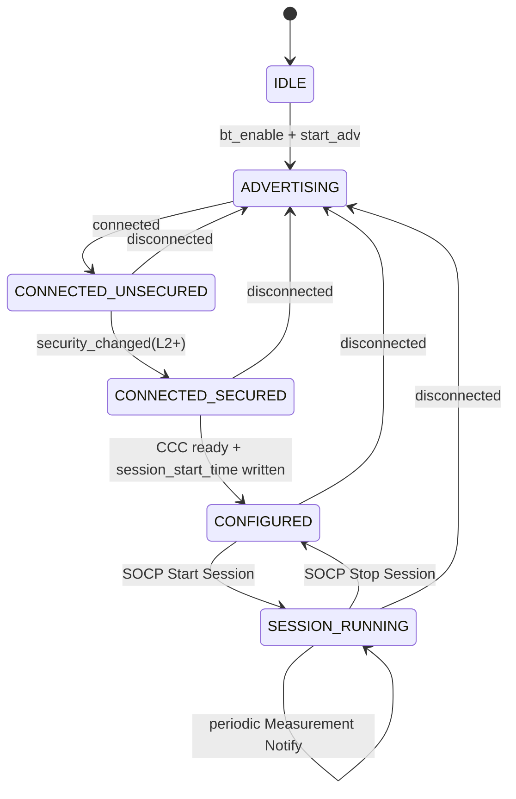
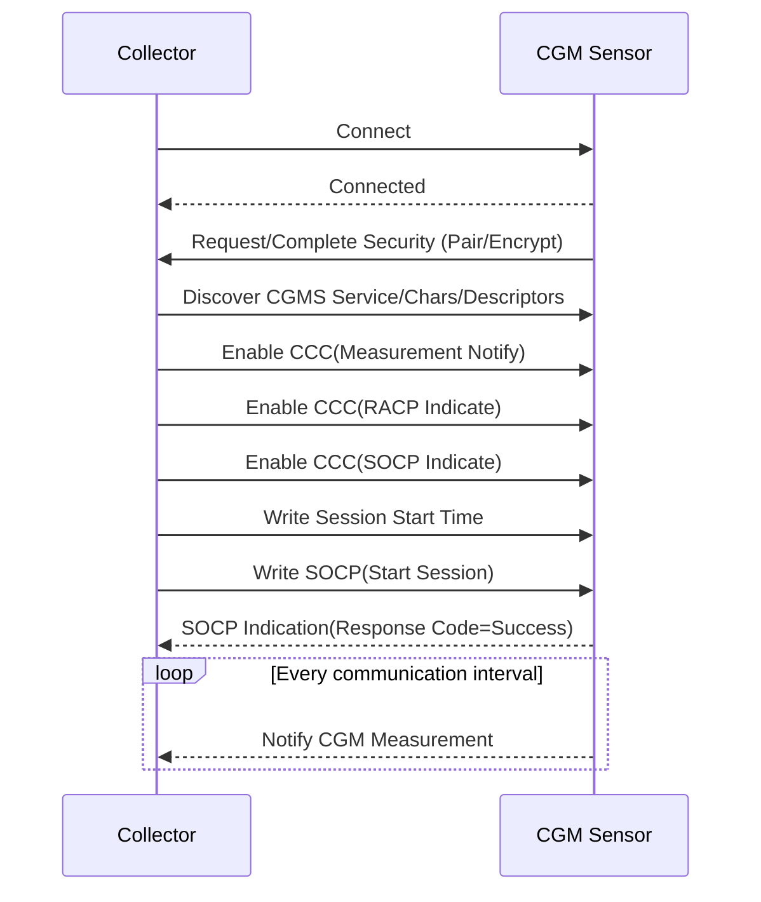
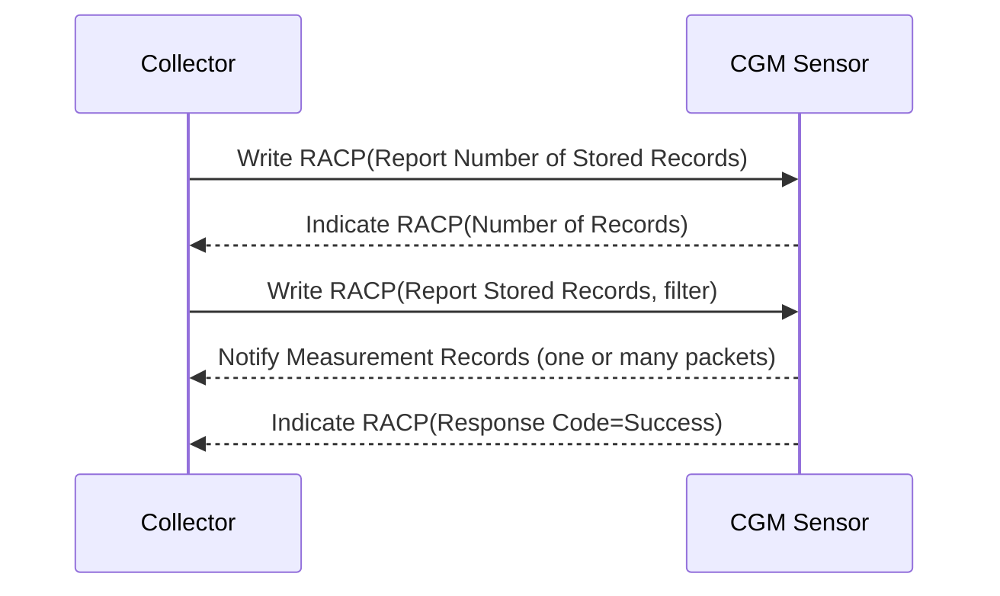

# CGMS BLE 模块程序设计说明（Sensor 端）

## 1. 文档目的与范围

本文档用于指导在当前 SDK 上实现 **CGM Sensor** 蓝牙模块，使其满足：

- CGMS v1.0.1（Continuous Glucose Monitoring Service）对 Sensor（Server）侧要求
- CGMP v1.0.1（Continuous Glucose Monitoring Profile）中与 Sensor 互联互通相关要求
- 与控制器（Collector/Controller）建立连接、加密、配置、会话与控制点交互规范

本文档聚焦 BLE 协议栈与 GATT 行为，不覆盖化学传感算法本体。

---

## 2. 参考规范与约束

## 2.1 参考文档

- CGMS_v1.0.1
- CGMP_v1.0.1

## 2.2 关键约束（落地必须满足）

1. CGM Measurement 与校准浓度单位按 **mg/dL** 传输。
2. CGM Feature 中“支持位”必须与实际实现一致，RFU 位必须置 0。
3. 若声明支持 E2E-CRC，则 Measurement/Status/Session Start/Session Run Time/SOCP 等相关特征必须携带 CRC 字段并参与计算。
4. Measurement 必须支持 Notify；RACP 与 SOCP 必须支持 Indicate。
5. 控制点流程（SOCP/RACP）需具备错误处理：不支持 OpCode、无效 Operand、CCC 未配置、过程冲突等。
6. Session Start Time 由客户端写入时间基准后，服务端以该基准管理会话时间与 Time Offset。
7. 多 Bond/多 Collector 需求时，控制点与记录数据库行为需一致（共享数据库策略）。

## 2.3 CGMP 第三章（CGM Sensor Role Requirements）补充清单

> 本节将 CGMP v1.0.1 第三章对 Sensor 角色的要求拆解为可执行条目；实现时需区分 **M（必须）/C（条件必须）/SHOULD（建议）/MAY（可选）**。

### 2.3.1 服务实例要求（Service Requirements）

1. **M**：CGM Sensor 必须实例化且仅实例化 **一个** CGM Service。
2. **M**：CGM Sensor 必须实例化 Device Information Service（DIS）。
3. **C1**：当支持 multiple bonds 时，Bond Management Service（BMS）为必须；否则可选。
4. 需同时关注 CGMP 后续章节（5.1、6.1）对 Sensor 角色的附加约束。

### 2.3.2 增量 CGM Service 要求（Incremental CGM Service Requirements）

1. Writable GAP Device Name Characteristic：
   - **MAY** 支持 Device Name 可写，以允许 Collector 配置设备名。
2. Low Energy 传输附加要求：
   - Service UUIDs AD Type：在可发现模式用于首次连接时，**SHOULD** 在广播/扫描响应中包含 CGM Service UUID（0x181F）。
   - Local Name AD Type：为提升用户体验，**SHOULD** 在广播或扫描响应中包含本地名称（完整或缩写）。
   - Appearance AD Type：为提升用户体验，**SHOULD** 在广播或扫描响应中包含 Appearance 值。
   - Target Address AD Types：为提升用户体验，**MAY** 包含 Public Target Address 或 Random Target Address。

### 2.3.3 增量 DIS 要求（Incremental Device Information Service Requirements）

1. **M**：Manufacturer Name String 必须提供。
2. **M**：Model Number String 必须提供。
3. **M**：System ID 必须提供。
4. 若设备字符串需被转码到 ISO/IEEE 11073 生态，相关字符串应限制为可打印 ASCII 子集，以保证兼容显示。

### 2.3.4 增量 BMS 要求（Incremental Bond Management Service Requirements）

1. 若实现 BMS，则以下特征为 **M**：
   - Bond Management Control Point
   - Bond Management Features

### 2.3.5 与本设计的落地关系

- 本文第 5 章“连接与配置流程”与第 15 章“文件级改造清单”需覆盖上述 M/C 条款。
- 广播数据当前已规划 `0x181F`，还需补充检查 Local Name/Appearance/Target Address 策略。
- 除 CGMS 服务外，工程需确认 DIS 已启用且字段完整；若宣称多 bond，需落地 BMS。

---

## 3. 系统设计总览

## 3.1 模块分层

- `连接管理层`
  - 广播、连接、断开、重连
  - 安全升级（配对/加密/bond）
  - 连接参数更新、MTU 协商
- `CGMS 服务层`
  - GATT 数据库注册
  - 特征读写回调与 CCC 管理
  - Notify/Indicate 发送策略
- `会话与记录层`
  - 会话状态、开始时间、运行时长、通信间隔
  - 测量记录队列与历史数据库
  - RACP 过滤、上报、删除、中止
- `设备配置层`
  - 告警阈值、高低限、校准参数
  - NVRAM 持久化

## 3.2 与现有工程文件映射（建议）

- `samples/ble_peripheral/src/actions/bt_le_op.c`
  - BLE 连接状态机、广播策略、安全触发
- `samples/ble_peripheral/src/actions/ble_super_service.c`
  - CGMS GATT 服务定义与回调实现
- `samples/ble_peripheral/src/include/ble_super_service.h`
  - 服务接口声明、句柄枚举
- `samples/ble_peripheral/src/actions/ble_data_test_sample.c`
  - 测量数据上送调度（可演进为真实采样管线）

---

## 4. GATT 接口定义（Sensor/Server）

## 4.1 Service 与 Characteristic 列表

Service UUID:

- `0x181F` Continuous Glucose Monitoring Service

Characteristic:

1. CGM Measurement (`0x2AA7`)
   - Property: Notify
   - Descriptor: CCCD (Notify)
   - 说明：周期或事件触发上传测量记录，可单包多记录

2. CGM Feature (`0x2AA8`)
   - Property: Read
   - 说明：能力位 + Type-Sample Location

3. CGM Status (`0x2AA9`)
   - Property: Read（可扩展 Notify）
   - 说明：与 Sensor Status Annunciation 语义对应

4. CGM Session Start Time (`0x2AAA`)
   - Property: Read/Write
   - 安全：建议 Write 需加密

5. CGM Session Run Time (`0x2AAB`)
   - Property: Read

6. Record Access Control Point, RACP (`0x2A52`)
   - Property: Write/Indicate
   - Descriptor: CCCD (Indicate)

7. CGM Specific Ops Control Point, SOCP (`0x2AAC`)
   - Property: Write/Indicate
   - Descriptor: CCCD (Indicate)

## 4.2 特征权限建议

- Measurement: 无需写权限
- Session Start Time: `READ + WRITE_ENCRYPT`
- RACP/SOCP: `WRITE_ENCRYPT + INDICATE`
- 目的：满足控制器写控制点时的安全要求并避免未加密滥写

## 4.3 数据结构约定（建议）

```c
typedef struct {
    uint16_t glucose_mg_dl;
    uint16_t time_offset_min;
    uint32_t sensor_status_annunciation; // 低24位有效
    int16_t trend;   // 可选
    uint16_t quality; // 可选
    bool has_trend;
    bool has_quality;
} cgm_measurement_record_t;

typedef struct {
    uint16_t feature_bits;
    uint8_t type_sample_location;
    bool e2e_crc_enabled;
    bool multiple_bond_enabled;
    bool multiple_session_enabled;
} cgm_feature_cfg_t;

typedef struct {
    bool connected;
    bool encrypted;
    bool meas_notify_enabled;
    bool racp_ind_enabled;
    bool socp_ind_enabled;
    bool session_started;
    uint8_t comm_interval_min;
    uint16_t session_run_time_min;
} cgm_runtime_ctx_t;
```

---

## 5. 连接与配置流程（CGMP 互通）

## 5.1 按 CGMP 第5章的 Sensor 建链规范

> 本节替代“泛化连接流程”，实现时应按 CGMP v1.0.1 Chapter 5 的场景化流程执行。

### 5.1.1 未绑定设备首次建链（Connection Procedure for Unbonded Devices）

1. Sensor 进入 **GAP General Discoverable Mode + Undirected Connectable Advertising**。
2. 广播参数建议：
   - 前 30 秒：`30 ms ~ 300 ms`（快速连接）
   - 30 秒后：`1 s ~ 10.24 s`（降功耗）
3. 在 Service Discovery 与 Encryption 完成前，Sensor 应接受 Collector 给出的有效连接间隔与连接延迟。
4. 完成发现与加密后，Sensor 再发起连接参数更新到自身偏好参数。
5. 如果CGM传感器在规定的时间限制内无法建立连接，该传感器可能会退出GAP可发现模式（discover mode）。在此过程  中，CGM传感器应处于可连接模式（bondable mode）。
6. Sensor 在该流程中应处于 bondable 模式；若建立 bond：
   - 建议把 Collector 地址写入 White List/Filter Accept List；
   - 广告过滤策略优先只允许白名单设备连接。

### 5.1.2 已绑定设备建链（Connection Procedure for Bonded Devices）

1. 当用户触发连接或有新测量待上送时，Sensor 应进入 Undirected Connectable Mode。
2. 建议在 Waiting Time（30~600 秒）内使用仅含已绑定地址的 White List。
3. Waiting Time 结束后可放开过滤，允许其他 Collector 连接。
4. 广播间隔同 5.1.1（前 30 秒快连，随后降功耗）。
5. 建链成功后，Sensor 可请求更新到自身偏好连接参数。

### 5.1.3 链路丢失重连（Link Loss Reconnection Procedure）

1. 链路丢失后，Sensor 应先进入 Undirected Connectable Mode（按推荐广播参数）。
2. Sensor **可选**短时使用 Directed Connectable Mode 以加速回连（注意能耗）。
3. Directed 尝试后应切回 Undirected Connectable Mode。

### 5.1.4 多 Bond 场景补充（Multi-Bond Considerations）

1. Sensor **可选**在广告/扫描响应中携带 Target Address AD Type（Public 或 Random）。
2. 可携带多个目标地址，避免非目标 Collector 抢连。
3. Target Address AD Type 每种类型在一个广告数据结构中仅应出现一次。
4. 多 bond 场景应结合 White List 过滤策略，减少误连接。

### 5.1.5 建链后业务配置（与 CGMS 业务衔接）

1. Collector 完成 Service/Characteristic/Descriptor 发现。
2. Collector 配置 CCC：
   - Measurement Notify = Enable
   - RACP Indicate = Enable
   - SOCP Indicate = Enable
3. Collector 写 Session Start Time。
4. Collector 通过 SOCP Start Session 启动会话。
5. Sensor 周期 Notify Measurement。

## 5.2 断连与会话收尾策略（与 Chapter 5 对齐）

- 链路正常结束：按产品策略由 Collector 或 Sensor 终止连接。
- 链路异常丢失：执行 5.1.3 的重连流程。
- 断连后应：
  - 清理临时过程上下文（正在进行的控制点过程）；
  - 保留会话数据与历史记录（按产品策略）；
  - 回到可连接广播，且遵循 5.1.x 对应场景参数。

---

## 6. SOCP/RACP 过程设计

## 6.1 SOCP（最小可交付集）

建议优先实现以下 OpCode：

- Set CGM Communication Interval
- Get CGM Communication Interval
- Start Session
- Stop Session
- Response Code

错误响应：

- Op Code Not Supported
- Invalid Operand
- Parameter Out of Range
- Procedure Not Completed

## 6.2 RACP（最小可交付集）

建议优先实现：

- Report Stored Records
- Report Number of Stored Records
- Delete Stored Records
- Abort Operation
- Response Code

关键规则：

- 未开启 RACP Indicate CCC 时，写入返回 CCC 未正确配置错误
- 过程进行中收到新的非 Abort 请求，返回 Procedure Already in Progress
- 过程结束必须回 Indication

---

## 7. 状态机图



---

## 8. 时序图

## 8.1 建链与会话启动



## 8.2 RACP 查询历史记录



---

## 9. 接口定义（软件接口）

## 9.1 连接管理接口

```c
void bt_le_op_init(void);
void system_ble_event_handle(uint32_t event);
void app_to_msg(uint8_t type, uint8_t event);
```

职责：初始化 BLE、启动广播、接收连接事件并转发给服务层。

## 9.2 CGMS 服务接口

```c
void ble_super_service_init(void);
void ble_super_on_connected(struct bt_conn *conn);
void ble_super_on_disconnected(struct bt_conn *conn);
uint8_t ble_super_ccc_enabled(struct bt_conn *conn, uint8_t handle);
void ble_super_send_notify(struct bt_conn *conn, uint8_t index, uint16_t len, uint8_t *p_value);
```

职责：管理 GATT 服务生命周期、控制点回调、测量通知。

## 9.3 会话与记录接口（建议新增）

```c
int cgm_session_start(void);
int cgm_session_stop(void);
int cgm_session_set_start_time(const uint8_t *base_time_9);
int cgm_set_comm_interval(uint8_t minute);
int cgm_record_append(const cgm_measurement_record_t *rec);
int cgm_racp_execute(const uint8_t *req, uint16_t req_len);
```

职责：将 BLE 协议层与业务数据层解耦，便于测试和后续维护。

---

## 10. 测试用例矩阵（落地版本）

| 用例ID | 类别 | 前置条件 | 步骤 | 预期结果 | 规范映射 |
|---|---|---|---|---|---|
| TC-01 | 广播 | 设备上电 | 扫描广告包 | 可发现 0x181F 服务UUID | CGMP 发现 |
| TC-02 | 连接 | 正常无线环境 | 建立连接 | 连接成功，进入已连接态 | CGMP 连接流程 |
| TC-03 | 安全 | 已连接 | 发起加密/配对 | 链路达到 L2+，可写控制点 | 控制点安全要求 |
| TC-04 | 服务发现 | 已连接 | 发现 CGMS 7 个特征及 CCC | 均可发现且属性正确 | CGMP 4.3 |
| TC-05 | Measurement CCC | 已连接 | 配置 Measurement CCC=Notify | 服务端开始允许上送测量 | CGMS 3.1.2 |
| TC-06 | SOCP CCC 缺失 | 未开启 SOCP CCC | 写 SOCP OpCode | 返回 CCC 未配置错误 | CGMS 控制点错误处理 |
| TC-07 | SOCP Start Session | 已加密+SOCP CCC | 写 Start Session | 返回 Success，进入运行态 | CGMS 3.7 |
| TC-08 | SOCP Stop Session | 会话运行中 | 写 Stop Session | 返回 Success，停止测量通知 | CGMS 3.7 |
| TC-09 | 通信间隔设置 | 已开启 SOCP | 写 Set Comm Interval | 参数生效，通知周期变化 | CGMS 3.7.2.1 |
| TC-10 | Measurement 格式 | 会话运行中 | 抓包解析 Measurement | mg/dL、Time Offset 递增、RFU=0 | CGMS 3.1 |
| TC-11 | RACP 记录数 | 已开启 RACP CCC | 写 Report Number | 收到 Indication，记录数正确 | CGMS 3.6 |
| TC-12 | RACP 报告记录 | 有历史记录 | 写 Report Stored Records | 收到记录通知 + 成功响应 | CGMS 3.6 |
| TC-13 | RACP 删除记录 | 有历史记录 | 写 Delete Stored Records | 删除成功并响应 | CGMS 3.6 |
| TC-14 | RACP 中止 | 过程进行中 | 写 Abort | 过程被终止并响应 | CGMS 3.6 |
| TC-15 | 断链恢复 | 会话运行中断链 | 重新连接并配置 CCC | 可恢复交互与数据上送 | CGMP 连接恢复 |
| TC-16 | Feature 一致性 | 支持位有配置 | 读取 Feature + 执行对应流程 | 支持位与行为一致，不支持位清零 | CGMS 3.2 |
| TC-17 | RFU 兼容 | 构造 RFU 场景 | 抓包检查 | Sensor 不置 RFU；Collector侧可容忍 RFU | CGMS/CGMP 兼容性 |
| TC-18 | E2E-CRC（可选） | 声明支持 E2E-CRC | 读取/写入相关特征 | 全路径 CRC 正确 | CGMS 3.11 |
| TC-19 | 单实例CGMS | 设备上电 | 扫描并做服务发现 | 仅存在 1 个 CGM Service | CGMP Ch3 Service Req |
| TC-20 | DIS必选字段 | 已连接 | 读取 DIS 特征 | Manufacturer Name/Model Number/System ID 均存在 | CGMP Ch3.2 |
| TC-21 | 广播UUID建议项 | 广播态 | 抓广告包 | 广告或扫描响应包含 0x181F | CGMP Ch3.1.2.1 |
| TC-22 | 广播本地名建议项 | 广播态 | 抓广告包 | 广告或扫描响应包含 Local Name | CGMP Ch3.1.2.2 |
| TC-23 | 广播Appearance建议项 | 广播态 | 抓广告包 | 广告或扫描响应包含 Appearance | CGMP Ch3.1.2.3 |
| TC-24 | BMS条件要求 | 支持多bond配置开启 | 服务发现+BMS读写检查 | BMS存在且含Control Point/Features | CGMP Ch3.3 |
| TC-25 | 未绑定快连窗口 | 未绑定设备 | 统计前30秒广播间隔 | 间隔落在30ms~300ms | CGMP Ch5.1.1 |
| TC-26 | 未绑定降功耗窗口 | 未绑定且超30秒 | 统计广播间隔 | 间隔落在1s~10.24s | CGMP Ch5.1.1 |
| TC-27 | 先完成发现/加密再调参 | 首次连接 | 抓连接参数时序 | 发现+加密完成后再请求偏好参数 | CGMP Ch5.1.1 |
| TC-28 | 已绑定白名单等待窗 | 已绑定设备 | 观察Waiting Time内过滤策略 | 30~600s内仅白名单可连 | CGMP Ch5.1.2 |
| TC-29 | 链路丢失回连策略 | 人为断链/屏蔽 | 观察重连模式切换 | 先Undirected，可选短时Directed，再回Undirected | CGMP Ch5.1.3 |
| TC-30 | 多bond目标地址广播 | 多bond开启 | 抓广告包 | Target Address AD Type 格式正确 | CGMP Ch5.1.4 |

---

## 11. 开发分阶段计划（建议）

### Phase 1：协议骨架（1~2 周）

- 完成标准 CGMS GATT 数据库与句柄稳定化
- 打通连接、安全、CCC 配置流程
- SOCP/RACP 基础响应框架

### Phase 2：业务数据打通（1~2 周）

- 会话时间管理
- Measurement 周期上报与字段完整性
- 历史记录数据库接入

### Phase 3：互通与合规（1~2 周）

- 手机/主机 Collector 联调
- 规范测试矩阵执行
- 抓包与异常路径修复

---

## 12. 风险与注意事项

1. **能力位-行为不一致**：最常见互通失败原因。
2. **控制点并发处理**：需严格过程互斥与错误码返回。
3. **时间基准漂移**：Session Start Time 与 Time Offset 一致性需严格验证。
4. **断链策略**：避免断链后设备不可重连。
5. **E2E-CRC**：若暂不实现，Feature 位必须关闭。

---

## 13. 交付定义（DoD）

满足以下条件视为 BLE 模块可交付：

- CGMS 服务结构与属性符合规范
- 连接、安全、CCC、会话流程可稳定执行
- SOCP/RACP 关键过程可用且错误处理正确
- 测量上报字段与单位正确（mg/dL）
- 测试矩阵核心用例（TC-01~TC-16）全部通过

---

## 14. 版本记录

- v1.0（2026-03-10）：初版，面向当前 SDK 的 CGMS Sensor BLE 落地设计。

---

## 15. 文件级改造清单（可直接派工）

> 目标：在不大改工程结构前提下，把当前 sample 改造成符合 CGMS/CGMP 的 Sensor 端实现。

## 15.1 改造总原则

- 不在第一阶段引入新目录，优先在既有文件中完成可运行闭环。
- 先做“协议骨架正确”，再做“业务数据完整”。
- 句柄与接口一旦确定，后续版本尽量不变，避免 App/测试脚本反复适配。

## 15.2 文件任务清单

### A. `samples/ble_peripheral/src/include/ble_super_service.h`

**改造目标**

- 从“自定义 super 服务句柄”重构为“标准 CGMS 特征句柄枚举”。
- 对外暴露 CGMS 服务生命周期接口，供连接层调用。

**建议改动点**

1. 定义标准句柄枚举（至少包含）：
   - Measurement / Feature / Status / Session Start / Session Run Time / RACP / SOCP 及对应 CCC。
2. 新增接口声明：
   - `ble_super_service_init()`
   - `ble_super_on_connected(struct bt_conn *conn)`
   - `ble_super_on_disconnected(struct bt_conn *conn)`
3. 保留兼容层（如旧逻辑仍依赖 `SUPER_TEST_HDL`，可短期 alias 到 Measurement 句柄）。

**完成判定**

- 头文件可独立编译，调用方不出现未定义符号。

---

### B. `samples/ble_peripheral/src/actions/ble_super_service.c`

**改造目标**

- 用标准 CGMS GATT 数据库替换现有自定义 128-bit 服务。
- 实现 SOCP/RACP 的最小可交付过程（含响应码、CCC 校验）。

**建议改动点（分步骤）**

1. **服务定义替换**
   - Primary Service 改为 `0x181F`。
   - 加入 7 个标准特征及 CCC。

2. **特征回调实现**
   - `Feature`：Read 回调返回 Feature bits + Type-Sample Location。
   - `Status`：Read（可选 Notify）。
   - `Session Start Time`：Read/Write（写入需校验 offset/len）。
   - `Session Run Time`：Read。

3. **Measurement 通知调度**
   - 基于 `k_delayed_work` 周期发送。
   - 包体包含 record length、glucose(mg/dL)、time offset、status（可按 feature 扩展 trend/quality）。
   - 仅在 `connected + CCC enabled + session running` 条件满足时发送。

4. **SOCP 过程最小集**
   - 实现：Set/Get Comm Interval、Start Session、Stop Session、Response Code。
   - 错误处理：无效参数、不支持 opcode、CCC 未配置。

5. **RACP 过程最小集**
   - 第一阶段可先返回基础响应（Success/No records），第二阶段接历史库。
   - 必须通过 Indication 返回结束状态。

6. **连接生命周期接口**
   - `ble_super_on_connected`：保存 conn 引用，必要时重启 notify 任务。
   - `ble_super_on_disconnected`：停止任务、释放 conn、清临时状态。

**完成判定**

- 抓包可见 CGMS 标准服务与特征。
- SOCP/RACP 可收发并有正确响应方向（Indication）。

---

### C. `samples/ble_peripheral/src/actions/bt_le_op.c`

**改造目标**

- 建立符合 CGMP 预期的连接与安全流程。

**建议改动点**

1. 广播数据包含 CGMS UUID `0x181F`（替换非 CGMS UUID）。
2. 连接后触发安全升级：
   - `bt_set_bondable(true)`
   - `bt_conn_set_security(conn, BT_SECURITY_L2)`
   - 注册 `security_changed` 回调记录加密状态。
3. 连接/断开事件联动服务层：
   - connected -> `ble_super_on_connected(conn)`
   - disconnected -> `ble_super_on_disconnected(conn)`
4. 断链策略改为“回到广播”，不要直接关机（除非产品明确要求一次性配对模式）。
5. 连接参数建议范围（示例）：
   - interval 100~200ms，latency 0，timeout 4~5s。
6. 按 CGMP Ch5 实现“分阶段广播参数”：
   - 前30秒使用快连窗口（30ms~300ms）；
   - 超时切换降功耗窗口（1s~10.24s）。
7. 首次连接场景下，在 service discovery + encryption 完成前不主动强改连接参数。
8. 已绑定场景加入 Waiting Time（30~600s）白名单过滤窗口。
9. 链路丢失回连支持：Undirected 主流程 + 可选短时 Directed 尝试。

**完成判定**

- 断链后可自动重新连接。
- 未加密状态下控制点写入受限；加密后可写入成功。

---

### D. `samples/ble_peripheral/src/actions/ble_data_test_sample.c`

**改造目标**

- 从“压力测试发送”改为“CGMS 记录调度入口”。

**建议改动点**

1. 保留延迟任务框架，移除与协议无关的填充数据发送路径。
2. 对接 `ble_super_send_notify()` 的 Measurement 句柄发送。
3. 提供记录提交接口，供后续真实传感采样模块调用。

**完成判定**

- 不再发送随机测试 payload；发送包结构与 CGMS Measurement 一致。

---

### E. `samples/ble_peripheral/src/actions/main.c`（如含 BLE 初始化入口）

**改造目标**

- 确保初始化顺序稳定。

**建议改动点**

1. `bt_enable` 成功后顺序：
   - `ble_super_service_init()`
   - `bt_le_op_init()`
2. 错误路径打印与上报统一化。

**完成判定**

- 上电后可稳定进入广播，无偶发空指针/未初始化句柄问题。

---

## 15.3 建议新增文件（第二阶段）

> 第一阶段可先不新增；第二阶段建议拆分，降低 `ble_super_service.c` 复杂度。

- `samples/ble_peripheral/src/actions/cgm_session.c/.h`
  - 会话状态、start/stop、run_time、comm_interval。
- `samples/ble_peripheral/src/actions/cgm_record_db.c/.h`
  - 环形数据库、过滤查询、删除、统计、持久化对接。
- `samples/ble_peripheral/src/actions/cgm_socp.c/.h`
  - SOCP opcode 解析与响应封装。
- `samples/ble_peripheral/src/actions/cgm_racp.c/.h`
  - RACP 过程状态机与错误处理。

---

## 15.4 分工建议（按角色）

- **协议工程师 A**：`ble_super_service.h/.c`（GATT + 控制点）
- **协议工程师 B**：`bt_le_op.c`（连接/安全/重连）
- **应用工程师 C**：`ble_data_test_sample.c` 与采样对接
- **测试工程师 D**：执行第 10 章矩阵 + 抓包验证

---

## 15.5 每日构建验收门槛（CI/本地）

1. 编译通过（无 warning-as-error 新增项）。
2. 广播可发现 `0x181F`。
3. 连接后可完成加密。
4. 开启 CCC 后可收到 Measurement Notify。
5. SOCP Start/Stop 至少可成功往返一次。

---

## 15.6 版本记录补充

- v1.1（2026-03-10）：新增“文件级改造清单（逐文件函数改动点）”，用于直接派工开发。